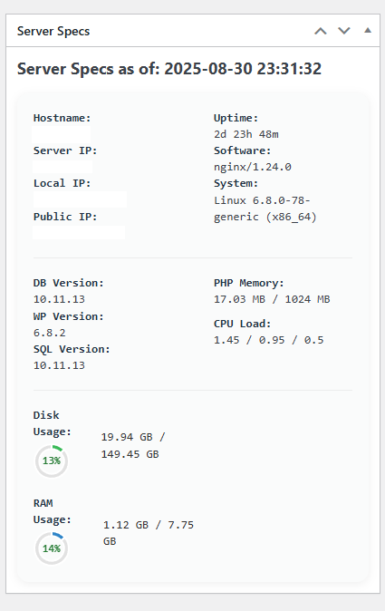

# 🥑 Avo Server Specs Dashboard Widget

Clean, visual server stats for your WordPress Dashboard—right where you need them.  
**Live charts. Real-time clock. Instant peace of mind.**  
Built by [AvocadoWeb Services LLC](https://avocadoweb.net) for the community.

---

## ✨ Features

- **Disk & RAM Usage:** Pie charts, at a glance.
- **Live Real-Time Clock:** Always current, local to your browser.
- **Server Details:** Hostname, server IP, local/public IPs, uptime, OS, web server.
- **WordPress & Database Info:** WP version, database version, SQL version.
- **CPU Load:** System load averages (shows 'Not available on AWS' if cloud-restricted).
- **No bloat, no tracking, no nags:** Just pure dashboard insight.

## 🚀 Quick Start

1. Download or clone this repo.
2. Upload `avo-server-widget` to your `/wp-content/plugins/` directory.
3. Activate via WordPress Admin > Plugins.
4. See your new **Server Specs** widget in the WP Dashboard!

## 🙌 Free and Open

This plugin is 100% free and open source.  
Enjoy it, use it on client sites, and share it with the world.

## 🛣️ Future Plans & Pro Features

We believe in *building together.*  
Here’s where we’re headed next—**future premium add-ons and updates (coming soon!):**

- Email, Slack, or Discord alerts for high CPU or low disk.
- PDF and email weekly reports.
- Uptime and status integration.
- Multi-site/network mode for agencies.
- White-label and custom branding.
- Custom color themes.
- More chart options and advanced stats.
- And… anything you request! [Open an issue](https://github.com/avocadowebservices/avo-server-widget/issues) or [start a discussion](https://github.com/avocadowebservices/avo-server-widget/discussions).

**The free version will always be useful, clean, and uncrippled.**  
Premium is for agencies, advanced users, and those who want a little extra magic.

## 📦 What’s Included?

- One-file plugin: `avo-server-widget.php`
- One chart.umd.min JS file in /js/ folder
- Screenshots: `/assets`
- No settings page, no extra database bloat. Just activate and go.

## 🙋 FAQ

**Q: Why does CPU Load say 'Not available on AWS'?**  
A: Some AWS and cloud hosts don’t provide system CPU info due to virtualization or security. The widget detects this and shows a friendly note.

**Q: Can I suggest features?**  
A: Please do! Use GitHub issues or discussions.

**Q: Can I use this for clients, agencies, or on unlimited sites?**  
A: Yes, forever—MIT licensed.

## ❤️ Credits

Made with care by Joseph Brzezowski,  
Founder of [AvocadoWeb Services LLC](https://avocadoweb.net).

For the Deaf, by the Deaf, for everyone who loves a good dashboard.

---

**MIT License.**  
No bloat, no nags, no fake scarcity.  
Just WordPress, made better.

